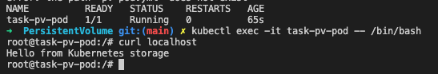

# Lab

## Objectives

We managed to do the 3 asked parts, the 3rd part following the tutorial linked in the Lab.

1. Use `emptyDir` storage
2. Use `hostPath` storage
3. Use PersistentVolume

## 1. Use `emptyDir` storage

1. We completed the [`assets/emptyDir/deployment.yml`](assets/emptyDir/deployment.yml) file.

Then we created a pod using `kubectl apply -f assets/emptyDir/deployment.yml`, and entered the container to curl the local host.

We got the 403 error output.

2. We created the index.html file

Being inside the container we used the command:

```
echo 'Hello from Kubernetes storage!' > /usr/share/nginx/html/index.html
```

Now when we use the command curl localhost we get the following response:

```
Hello from Kubernetes storage!
```

## 2. Use `hostPath` storage

1. First we completed the [`assets/hostPath/deployment.yml`](assets/hostPath/deployment.yml) file using the documentation.

Then we ran a pod applying configuration:

```
kubectl apply -f assets/hostPath/deployment.yml
```

When using the `curl localhost` command we get a 403 error as in the task number 1.

2. Then we created the `/mnt/hostPath/index.html` file with some content **inside a VM**

We went inside the VM with the `minikube ssh` command, and created the index.html file in the `/mnt/hostPath` repo with the following commands:

```
sudo mkdir /mnt/hostPath
sudo chmod -R 777 /mnt/hostPath
sudo echo 'Hello from Kubernetes storage!' > /mnt/hostPath/index.html
```

Now when we run `curl localhost` from the container it outputs:

```
Hello from Kubernetes storage!
```

[screenshot part2](image/part2.png)

## 3. Use PersistentVolume

1. First we create an HTML file on our node. We use the command `minikube ssh` again, and then inside the bash
   use the following commands to create the file and verify it exists:

```
sudo mkdir /mnt/data
sudo sh -c "echo 'Hello from Kubernetes storage' > /mnt/data/index.html"
cat /mnt/data/index.html
```

2. We create a persitent volume, with the configuration in [`assets/PersistentVolume/pv-volume.yaml`]

We create the persitent volume and display again the volume status which is now bounded:

```
kubectl apply -f pv-claim.yml
kubectl get pv task-pv-volume
```

3. We create a persitent volume claim, with the configuration in [`assets/PersistentVolume/pv-claim.yaml`]

We create the persitent volume claim and display its available status with the commands:

```
kubectl apply -f pv.volume.yml
kubectl get pv task-pv-volume
```

We now look at the persitent volume claim and see it is bounded to our persitent volume:

```
kubectl get pvc task-pv-claim
```

4. We create a pod, with the configuration in [`assets/PersistentVolume/pv-pod.yaml`]

We create the pod, get it name and then get a shell to the container:

```
kubectl apply -f pv-pod.yml
kubectl get pod task-pv-pod
kubectl exec -it task-pv-pod -- /bin/bash
```

Inside the shell we curl the localhost with `curl localhost` and get the output:

```
Hello from Kubernetes storage
```


